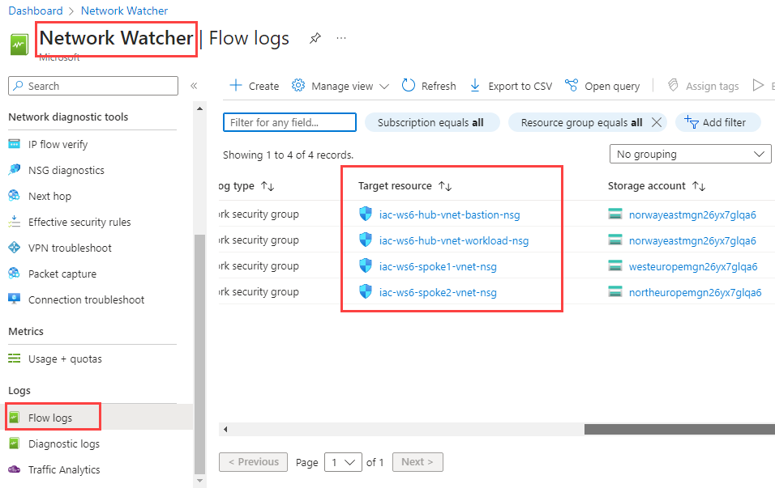

# lab-04 - log network traffic with Network Security Group flow logs

Network security groups (NSG) flow logging is a feature of Azure Network Watcher that allows you to log information about IP traffic flowing through a network security group. Flow data is sent to Azure Storage from where you can access it and export it to any visualization tool.

In this lab we will enable NSG flow logs for `iac-ws6-spoke1-vnet-nsg` and `iac-ws6-spoke2-vnet-nsg` NSGs and then we will use Azure Storage Explorer to view the logs and troubleshoot connectivity issues.

## Task #1 - enable NSG flow logs for `iac-ws6-spoke1-vnet-nsg` using Azure portal

Navigate to `Monitoring->NSG flow logs` blade of `iac-ws6-spoke2-vnet-nsg` Network Security Group resource and click on `Create`.


At the `Basic` tab, select your Subscription and click on `Select resource`


From the list of available NSGs, select `iac-ws6-spoke2-vnet-nsg` and click on `Confirm selection`


Under the `Instance details` section, select `Storage account` that starts with `northeuropexxx`, set `Retention (days)` to 30 and click on `Next: Analytics >`


At the `Analytics` tab:
- select `Flow Logs Version` to `Version 2`
- enable Traffic Analytics
- set `Traffic Analytics processing interval` to every 10 min
- select `iac-ws6-.....-log` as `Log Analytics Workspace`  

When filled, click on `Review + create` and then on `Create`


## Task #2 - enable NSG flow logs for `iac-ws6-spoke1-vnet-nsg` using Bicep

Let's configure flow logs for `iac-ws6-spoke1-vnet-nsg` using Bicep. We need to collect some resource ids first. 

```powershell`
# Get Network Security Group Id. It will be used as a parNsgId parameter for Bicep template.
az network nsg show -n iac-ws6-spoke1-vnet-nsg -g iac-ws6-spoke1-rg --query id -otsv

# Get Storage Account Id for SA located at NorthEurope. It will be used as a parStorageId parameter for Bicep template.
az storage account list -g iac-ws6-hub-rg --query "[?location=='westeurope'].id" -otsv

# Get Log Analytics Workspace Id. It will be used as a parWorkspaceResourceId parameter for Bicep template. 
az monitor log-analytics workspace list -g iac-ws6-hub-rg --query [0].id -otsv
```

Create new `flowlogs.bicep` file with the following content. Use ids we collected in previous step to fill in parameters.

```bicep
param parLocation string = 'westeurope'
param parNsgId string = ''
param parStorageId string = ''
param parWorkspaceResourceId string = ''
param parNetworkWatcherName string = 'NetworkWatcher_${parLocation}'
param parFlowlogName string = 'iac-ws6-spoke1-vnet-nsg-flowlog'

resource resFlowlogBastionNsg 'Microsoft.Network/networkWatchers/flowLogs@2023-05-01' = {
  name: '${parNetworkWatcherName}/${parFlowlogName}'
  location: parLocation
  properties: {
    targetResourceId: parNsgId
    storageId: parStorageId
    enabled: true
    format: {
      type: 'JSON'
      version: 2
    }
    flowAnalyticsConfiguration: {
      networkWatcherFlowAnalyticsConfiguration: {
        enabled: true
        workspaceRegion: 'norwayeast'
        workspaceResourceId: parWorkspaceResourceId
        trafficAnalyticsInterval: 10
      }
    }
    retentionPolicy: {
      days: 30
      enabled: true
    }
  }
}
```

Deploy Bicep template using the following command:

```powershell
az deployment group create --resource-group 'NetworkWatcherRG' --template-file .\flowlogs.bicep
```	

If you now go to [Network Watcher -> Flow logs](https://portal.azure.com/#view/Microsoft_Azure_Network/NetworkWatcherMenuBlade/~/flowLogs), you should see that all four Network Security Groups used in our lab environment have flow logs enabled.


