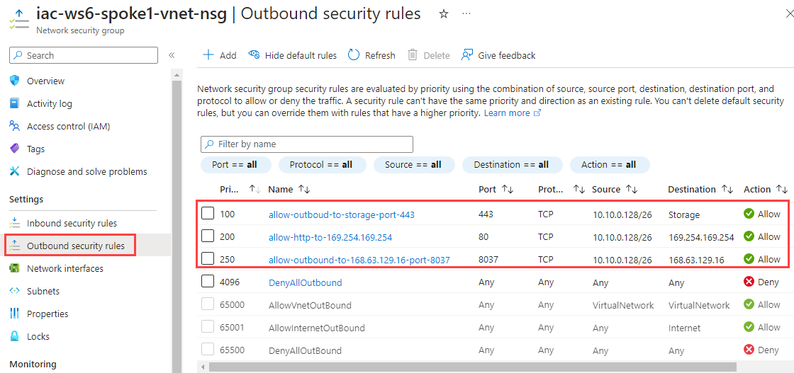
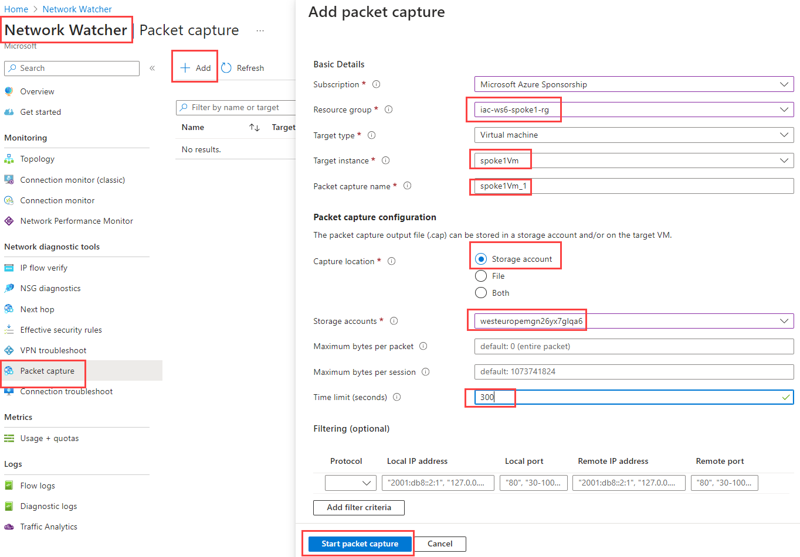
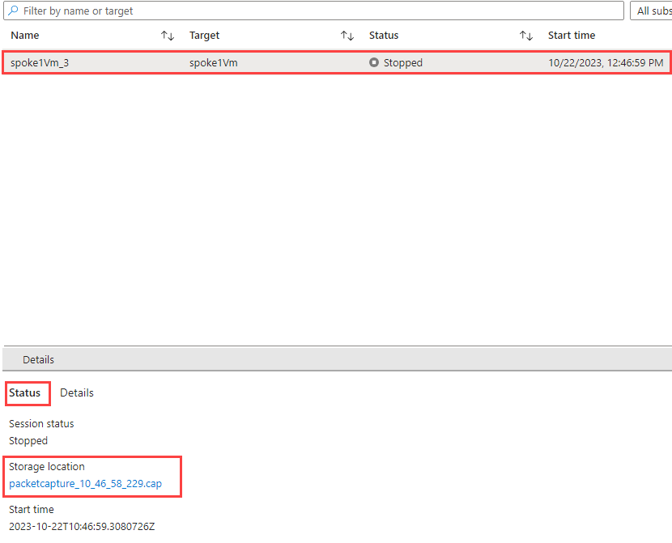
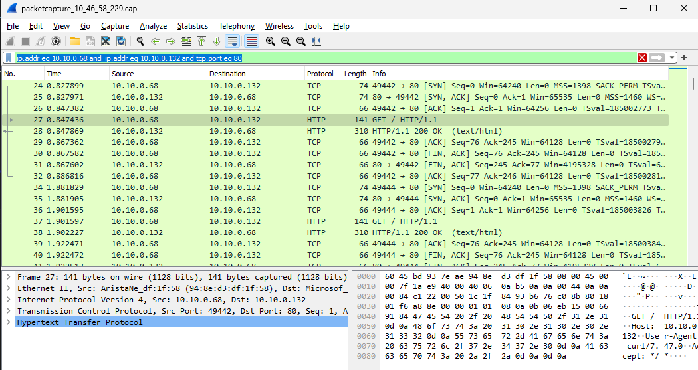

# lab-05 - Network Packet Capture with Network Watcher and Wireshark

Azure Network Watcher packet capture allows you to create packet capture sessions to track traffic to and from a virtual machine. Here are some of the typical use-cases:
- diagnose network anomalies
- gathering network statistics
- debug client-server communications

Packet capture is an VM extension that is remotely started through Network Watcher. Packet capture can be triggered through the portal, PowerShell, Azure CLI, or REST API. Filters are provided for the capture session to ensure you capture traffic you want to monitor. Filters are based on 5-tuple information. The captured data can be stored to the local disk or a storage blob.

Let's capture incoming traffic to a `spoke1Vm` and analyze it with Wireshark.

## Task #1 - send some traffic from `hubVm` to `spoke1Vm`

First, let's send some traffic from `hubVm` to `spoke1Vm` to capture it later on. 
SSH into `hubVm` and run the following command:

```bash
watch -n 1 curl -s http://10.10.0.132
```	

## Task #2 - create a packet capture session

!!! info "Note"
    A virtual machine where you want to capture packets, [should have the following outbound TCP connectivity](https://learn.microsoft.com/en-us/azure/network-watcher/network-watcher-packet-capture-manage-portal#prerequisites):

    - 443 (HTTPS) to Azure Storage
    - 80 to 169.254.169.254
    - 8037 to 168.63.129.16

In our lab, it was already configured with master deployment.

 

Navigate to [Network watcher -> Packet capture](https://portal.azure.com/#view/Microsoft_Azure_Network/NetworkWatcherMenuBlade/~/packetCapture) and click `+ Add`



Fill in the following information:

| Parameter | Value |
|---|---|
| Target type  | `Virtual machine` |
| Target instance  | `spoke1Vm` |
| Packet capture name  | `spoke1Vm` |
| Capture location | `Storage account` |
| Storage accounts | Choose of your storage accounts  |
| Time limit (seconds) | 300 |

Click on `Start packet capture`.

It will first deploy `AzureWatcherExtension` to the VM (if oen hasn't been deployed yet) and then start the capture session.


When deployed, you should see the capture session running:


Now, either wait 5 min and let the session stop itself, or wait at least 3 min and then stop the session manually.


You cna now download the capture file from session `Details` page. 



Click on link under `Storage location` section.


Click `Download`.

You can also find this file in your storage account. 

## Task #3 - open capture file in Whireshark

First, [download and install Whireshark](https://www.wireshark.org/download.html) if you don't have it on your PC. On Windows, use winget to install it:

```powershell
winget install -e --id WiresharkFoundation.Wireshark
```

When installed, open the capture file in Wireshark. You should see something similar to this:


Now, let's filter packets only to traffic between `hubVm (10.10.0.68)` and `spoke1Vm (10.10.0.132)` at port 80. Add the following filter to the filter bar:

```txt
ip.addr eq 10.10.0.68 and ip.addr eq 10.10.0.132 and tcp.port eq 80
```	



## Links

- [Manage packet captures in virtual machines with Azure Network Watcher](https://learn.microsoft.com/en-us/azure/network-watcher/network-watcher-packet-capture-manage-portal#prerequisites)